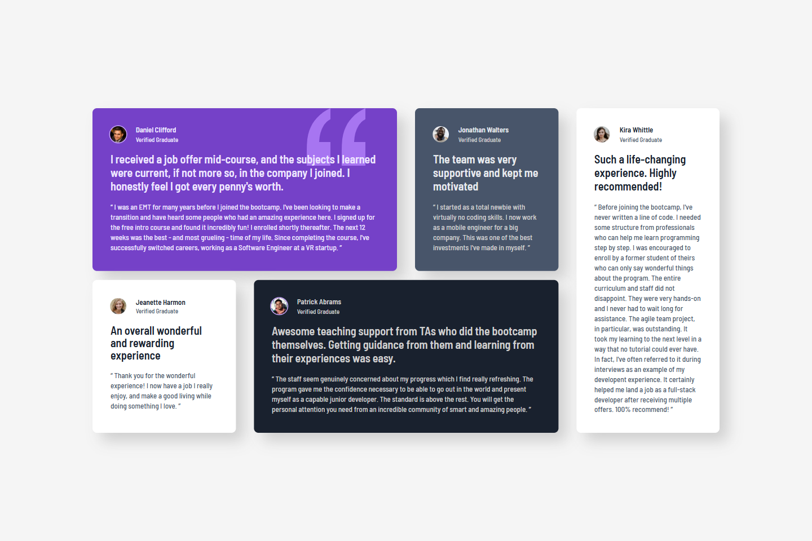
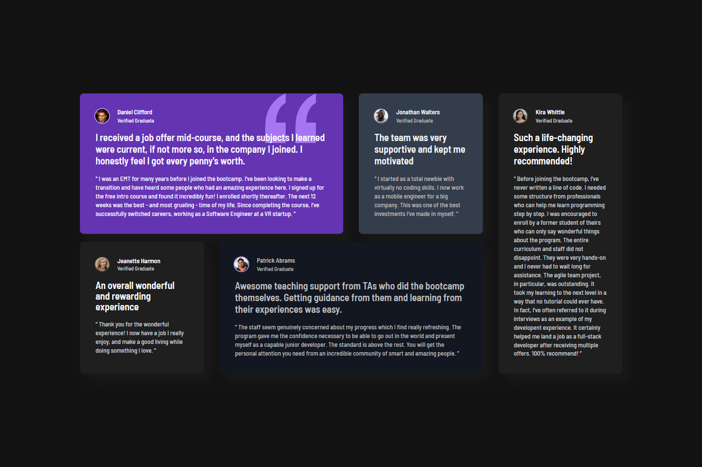

# 💻 Testimonials Grid Section

## ℹ️ A Responsive Grid of Testimonials Section Page

| _Mobile Preview (375x812)_                                   | _Desktop Preview (1440x960)_                                    |
| ------------------------------------------------------------ | --------------------------------------------------------------- |
|       |       |
|  |  |

This project showcases a responsive grid of testimonial cards, each featuring a real-world user’s experience.

Created as part of the building challenges from [Frontend Mentor](https://www.frontendmentor.io/).

---

## 🔍 Overview

This site was built using semantic HTML5 and custom CSS, with accessibility and responsive design in mind where each testimonial card is styled individually using CSS Grid with named areas.

It features subtle hover effects, adaptive color schemes (light/dark), semantic ARIA markup, and is also optimized for reduced motion preferences and high-contrast environments.

---

## ✨ Features

- Mobile-first responsive design using CSS Grid
- Dark mode support using `prefers-color-scheme`
- Accessibility with semantic HTML and ARIA attributes
- Custom layout using named `grid-template-areas`
- Adaptive image sizing and inline SVG styling
- Custom testimonial card components with visual hierarchy
- PerfectPixel usage for pixel-precision alignment

---

## 🧠 What I Learned

- Implementing advanced CSS Grid with area mapping for dynamic layouts
- Creating and organizing CSS variables for theme toggles
- Using `aria-labelledby` and `aria-describedby` for assistive technology navigation
- Designing for reduced motion preferences with fallbacks
- Structuring large multi-section layouts with scalable CSS architecture
- Troubleshooting alignment and spacing using PerfectPixel
- Applying a clean and organized project directory structure for scalability
- Self-hosting fonts using `@font-face` for performance and control

---

## 🛠️ Tech Used

- HTML5
- CSS3
- Git
- GitHub
- Netlify

---

## 🎨 Design Reference & Tools

- JPG design image
- PerfectPixel

---

## 🚀 How to Run

1. Clone the repository
2. Open `index.html` in your browser

---

## 🌐 Live Demo

Or you can check out the 👉 [live website here](https://testimonials-grid-section-fm-jiro.netlify.app/)

---

## 📊 Performance Report

A **Google Lighthouse** audit was conducted on the final version of this project. You can view the full report [here](./assets/downloads/lighthouse-performance-report.pdf).

---

## 🧑‍💻 Author

Created by **Elmar Chavez**

🗓️ Month/Year: **June 2025**

📚 Journey: **3rd** month of learning _frontend web development_.
